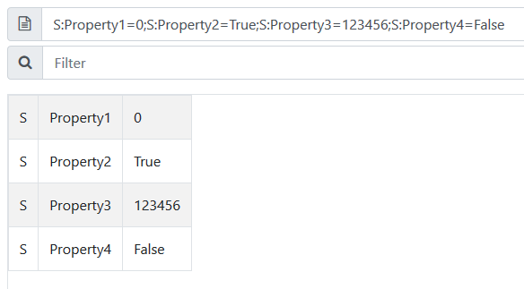

# Custom-Data-Viewer

Format the column custome_data of the Office 365 message tracking report to a table more readable.

## Example

```
S:Property1=0;S:Property2=True;S:Property3=123456;S:Property4=False
```

